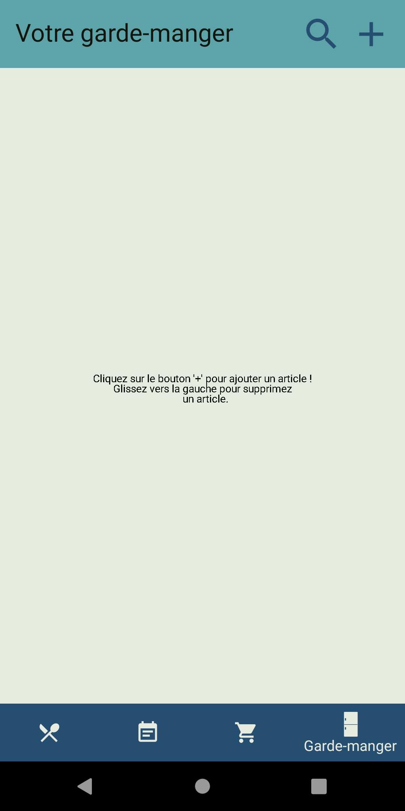

### App disponible en EN/FR
 

# Description
Application autour de la pratique du "Meal prep", elle contient 4 onglets que vous pouvez voir juste en dessous !

# Screenshots par onglet
- [Liste de course](#liste-de-course)
  - [Examples](#examples-liste-de-course)
  - [Vide](#liste-de-course-vide)
  - [Ajouter un article](#ajouter-un-article)
  - [Mode shopping](#mode-shopping)
- [Garde-manger](#garde-manger)
  - [Examples](#examples-garde-manger)
  - [Vide](#garde-manger-vide)
  - [Ajouter un article](#ajouter-un-article-dans-le-garde-manger)
- [Recettes](#recettes)
  - [Examples](#examples-recettes)
  - [Vide](#recettes-vide)
  - [Ajouter une recette](#ajouter-une-recette)
  - [Suivre une recette](#suivre-une-recette)
- [Calendrier](#calendrier)
  - [Examples](#examples-calendrier)
  - [Vide](#calendrier-vide)
  - [Ajouter un repas](#ajouter-un-repas)
  - [Voir ces repas](#voir-ces-repas-depuis-le-calendrier)

# Liste de course
## Examples liste de course

## Liste de course vide

## Ajouter un article

## Mode shopping

# Garde-manger
## Examples garde manger

## Garde-manger vide

## Ajouter un article dans le garde-manger

# Recettes
## Examples recettes

## Recettes vide

## Ajouter une recette

## Suivre une recette

# Calendrier
## Examples calendrier

## Calendrier vide

## Ajouter un repas

## Voir ces repas depuis le calendrier

